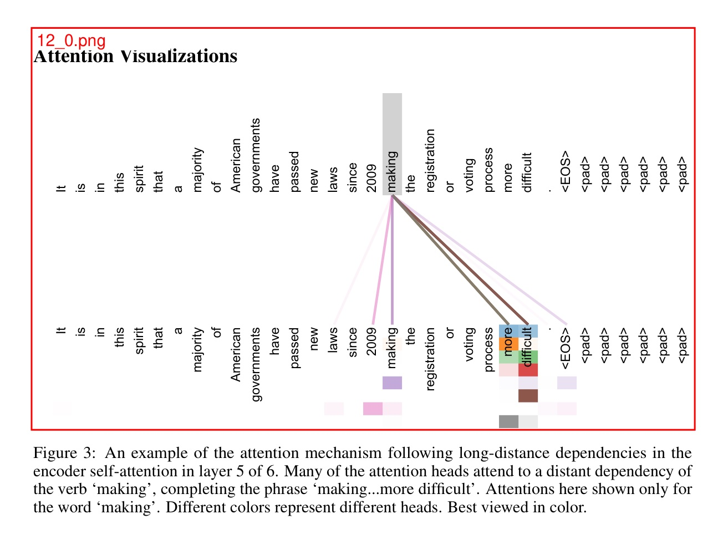

# gptpdf

<p align="center">
<a href="README_CN.md"></a>
<a href="README.md"></a>
</p>

Using VLLM (like GPT-4o) to parse PDF into markdown.

Our approach is very simple (only 293 lines of code), but can almost perfectly parse typography, math formulas, tables, pictures, charts, etc.

Average cost per page: $0.013

This package use [GeneralAgent](https://github.com/CosmosShadow/GeneralAgent) lib to interact with OpenAI API.

[pdfgpt-ui](https://github.com/daodao97/gptpdf-ui) is a visual tool based on gptpdf.


## Process steps

1. Use the PyMuPDF library to parse the PDF to find all non-text areas and mark them, for example:



2. Use a large visual model (such as GPT-4o) to parse and get a markdown file.


## DEMO

1. [examples/attention_is_all_you_need/output.md](examples/attention_is_all_you_need/output.md) for PDF [examples/attention_is_all_you_need.pdf](examples/attention_is_all_you_need.pdf).


2. [examples/rh/output.md](examples/rh/output.md) for PDF [examples/rh.pdf](examples/rh.pdf).


## Installation

```bash
pip install gptpdf
```


## Usage

```python
from gptpdf import parse_pdf
api_key = 'Your OpenAI API Key'
content, image_paths = parse_pdf(pdf_path, api_key=api_key)
print(content)
```

See more in [test/test.py](test/test.py)


## API

### parse_pdf

**Function**: 
```
def parse_pdf(
        pdf_path: str,
        output_dir: str = './',
        prompt: Optional[Dict] = None,
        api_key: Optional[str] = None,
        base_url: Optional[str] = None,
        model: str = 'gpt-4o',
        verbose: bool = False,
        gpt_worker: int = 1
) -> Tuple[str, List[str]]:
```

Parses a PDF file into a Markdown file and returns the Markdown content along with all image paths.

**Parameters**:

- **pdf_path**: *str*  
  Path to the PDF file

- **output_dir**: *str*, default: './'  
  Output directory to store all images and the Markdown file

- **api_key**: *Optional[str]*, optional  
  OpenAI API key. If not provided, the `OPENAI_API_KEY` environment variable will be used.

- **base_url**: *Optional[str]*, optional  
  OpenAI base URL. If not provided, the `OPENAI_BASE_URL` environment variable will be used. This can be modified to call other large model services with OpenAI API interfaces, such as `GLM-4V`.

- **model**: *str*, default: 'gpt-4o'  
  OpenAI API formatted multimodal large model. If you need to use other models, such as:
  - [qwen-vl-max](https://help.aliyun.com/zh/dashscope/developer-reference/vl-plus-quick-start) (untested)
  - [GLM-4V](https://open.bigmodel.cn/dev/api#glm-4v) (tested)
  - Azure OpenAI, by setting the `base_url` to `https://xxxx.openai.azure.com/` to use Azure OpenAI, where `api_key` is the Azure API key, and the model is similar to `azure_xxxx`, where `xxxx` is the deployed model name (tested).

- **verbose**: *bool*, default: False  
  Verbose mode. When enabled, the content parsed by the large model will be displayed in the command line.

- **gpt_worker**: *int*, default: 1  
  Number of GPT parsing worker threads. If your machine has better performance, you can increase this value to speed up the parsing.

- **prompt**: *dict*, optional  
  If the model you are using does not match the default prompt provided in this repository and cannot achieve the best results, we support adding custom prompts. The prompts in the repository are divided into three parts:
  - `prompt`: Mainly used to guide the model on how to process and convert text content in images.
  - `rect_prompt`: Used to handle cases where specific areas (such as tables or images) are marked in the image.
  - `role_prompt`: Defines the role of the model to ensure the model understands it is performing a PDF document parsing task.

  You can pass custom prompts in the form of a dictionary to replace any of the prompts. Here is an example:

  ```python
  prompt = {
      "prompt": "Custom prompt text",
      "rect_prompt": "Custom rect prompt",
      "role_prompt": "Custom role prompt"
  }

  content, image_paths = parse_pdf(
      pdf_path=pdf_path,
      output_dir='./output',
      model="gpt-4o",
      prompt=prompt,
      verbose=False,
  )

## Version

- 0.0.9~0.0.10: Optimize pdf parsing process, better parsing effect
- 0.0.2 - 0.0.8: Add gpt_worker parameter；Add GLM-4V, Azure OpenAI support; Fix some bugs
- 0.0.1: First version
  
## Join Us 👏🏻

Scan the QR code below with WeChat to join our group chat or contribute.

<p align="center">

</p>
