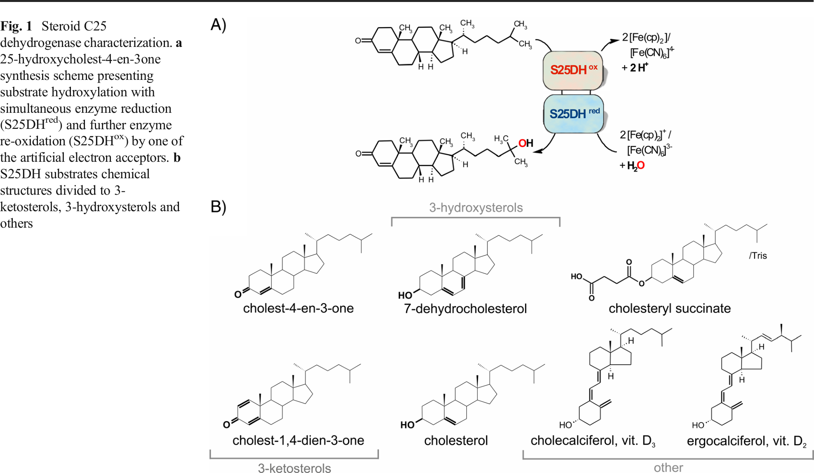
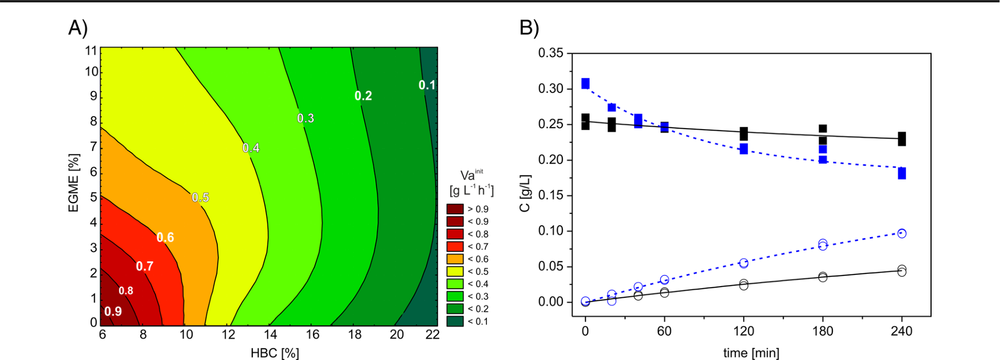
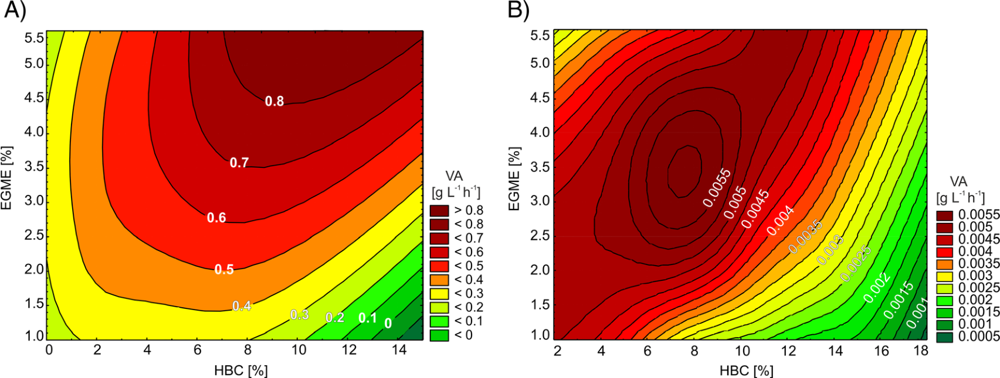
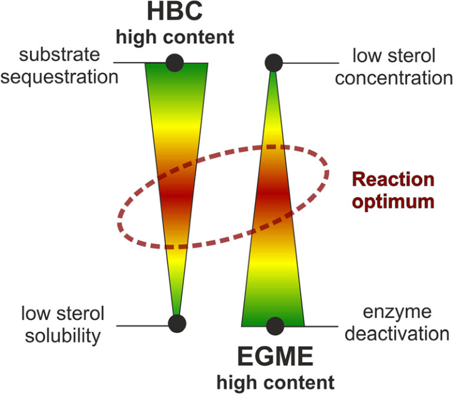

# Regioselective hydroxylation of cholecalciferol, cholesterol and other sterol derivatives by steroid C25 dehydrogenase

Received: 14 April 2016 / Revised: 25 August 2016 / Accepted: 20 September 2016 / Published online: 11 October 2016  
© Springer-Verlag Berlin Heidelberg 2016

**Abstract** Steroid C25 dehydrogenase (S25DH) from *Sterolibacterium denitrificans* Chol-1S is a molybdenum oxido-reductase belonging to the so-called ethylbenzene dehydrogenase (EBDH)-like subclass of DMSO reductases capable of the regioselective hydroxylation of cholesterol or cholecalciferol to 25-hydroxy products. Both products are important biologically active molecules: 25-hydroxycholesterol is responsible for a complex regulatory function in the immunological system, while 25-hydroxycholecalciferol (calcifediol) is the activated form of vitamin D$_3$ used in the treatment of rickets and other calcium disorders. Studies revealed that the optimal enzymatic synthesis proceeds in fed-batch reactors under anaerobic conditions, with 6–9 % (w/v) 2-hydroxypropyl-β-cyclodextrin as solubilizer and 1.25–5 % (v/v) 2-methoxyethanol as an organic co-solvent, both adjusted to the substrate type, and 8–15 mM K$_3$[Fe(CN)$_6$] as an electron acceptor. Such thorough optimization of the reaction conditions resulted in high product concentrations: 0.8 g/L for 25-hydroxycholesterol, 1.4 g/L for calcifediol and 2.2 g/L for 25-hydroxy-3-ketosterols. Although the purification protocol yields approximately 2.3 mg of pure S25DH from 30 g of wet cell mass (specific activity of 14 nmol min$^{-1}$ mg$^{-1}$), the non-purified crude extract or enzyme preparation can be readily used for the regioselective hydroxylation of both cholesterol and cholecalciferol. On the other hand, pure S25DH can be efficiently immobilized either on powder or a monolithic silica support functionalized with an organic linker providing NH$_2$ groups for enzyme covalent binding. Although such immobilization reduced the enzyme initial activity to less than twofold it extended S25DH catalytic lifetime under working conditions at least 3.5 times.

**Keywords** Calcifediol · 25-hydroxycholesterol · Regioselective hydroxylation · Sterol · Steroid C25 dehydrogenase · Molybdenum enzyme

**Electronic supplementary material** The online version of this article (doi:10.1007/s00253-016-7882-2) contains supplementary material, which is available to authorized users.

**M. Szaleniec**  
ncszalen@cyf-kr.edu.pl

1 Jerzy Haber Institute of Catalysis and Surface Chemistry, Polish Academy of Sciences, Niezapominajek 8, PL-30239 Krakow, Poland  
2 Institute of Pharmacology, Polish Academy of Sciences, Smetna 12, 31343 Krakow, Poland  
3 Department of Organic Chemistry, Faculty of Chemistry, Jagiellonian University, Ingardena 3, 30060 Krakow, Poland  
4 Department of Chemical Engineering, Silesian University of Technology, Ks. M. Strzody 7, 44100 Gliwice, Poland  
5 Institute of Chemical Engineering, Polish Academy of Sciences, Batycka 5, 44100 Gliwice, Poland  
6 Department of Biotechnology and Food Microbiology, Poznan University of Life Sciences, Wojska Polskiego 48, 60627 Poznan, Poland

**Introduction**

Sterols are ubiquitous compounds in nature that play a range of physiological roles in all living organisms. In mammals, they are mostly used as cell membrane components, hormones, and vitamin D precursors, which leads to their wide application as pharmaceuticals. Therefore, the ability to modify their base structure and to introduce functional groups is of the utmost importance. Although traditional methods of organic chemistry in the synthesis of many steroid drugs have been successfully used with great efficiency, biocatalytic methods (being more selective and environmentally friendly) have recently attracted more attention and have been incorporated into the organic

chemist's toolbox (Brixius-Anderko et al. 2015; Donova 2007; Holland 1992; Riva 1991; Zhang et al. 2014).

25-hydroxylated derivatives of sterols play an important role in human metabolic control and treatment of associated disorders. 25-hydroxycholesterol (25-OH-Ch) is known to perform a complex regulatory function in the immunological system by (i) controlling the differentiation of monocytes into macrophages, (ii) suppressing the production of IgA by B cells, and (iii) directing the migration of activated B cells to the germinal follicle (Bauman et al. 2009; McDonald and Russell 2010; Reboldi et al. 2014). Thus, 25-OH-Ch is proposed as a drug in diseases associated with IgA overproduction such as Berger disease (Bauman et al. 2009). Calcifediol (25-OH-D$_3$) is an activated form of cholecalciferol (vitamin D$_3$), an important compound introduced into the organism from dietary sources or formed in skin tissue from 7-dehydrocholesterol after sunlight UV irradiation and further activation (regioselective hydroxylation) in liver (Zhu et al. 2013). 25-OH-D$_3$ is the main blood-circulating metabolite responsible for maintaining calcium and phosphate homeostasis. As a drug, calcifediol is much more potent than the parental vitamin D$_3$ and therefore is used in the treatment of rickets and other calcium disorders (Bischoff-Ferrari et al. 2012; Brandi and Minisola 2013; Jetter et al. 2014).

However, the production of sterols derivatives activated at position 25 and their use in medical applications is limited by the chemical synthesis of both compounds require a multi-step approach which poses high time and labor demands on the production and results in relatively low yields of the overall synthetic pathways (6–25 %) (Kurek-Tyrlik et al. 2005; Miyamoto et al. 1986; Ogawa et al. 2009; Riediker and Schwartz 1981; Reynar et al. 2002; Westover and Covey 2006). The more efficient method of 25-OH-Ch synthesis (yield 60–70 %) requires an expensive starting material such as desmosterol (Zhao et al. 2014). On the other hand, the reported enzymatic methods are much more straightforward and usually involve single hydroxylation step catalyzed by P450 cytochromes (Ban et al. 2014; Yasuda et al. 2013; Yasutake et al. 2013) or a non-heme monooxygenase overproduced in transgenic plants Arabidopsis thaliana and Solanum tuberosum (Beste et al. 2011).

Steroid C25 dehydrogenase (S25DH) from $\beta$-proteobacterium *Sterolibacterium denitrificans* (Chol-1S), a facultative anaerobic microorganism capable of the full mineralization of cholesterol in both aerobic and anaerobic conditions (Tarlera 2003) appears to be another example of a catalyst for the regioselective hydroxylation of sterols and their derivatives. S25DH is a molybdenum enzyme belonging to the so-called ethylbenzene dehydrogenase (EBDH)-like subclass of DMSO reductases (Heider et al. 2016; Hill et al. 2014). It is a heterotrimer ($\alpha\beta\gamma$, 168 ± 12 kDa) containing a bis-pyranopterin-guanine dinucleotides (MGD)-molybdenum cofactor and [4Fe-4S] cluster in the $\alpha$ subunit (108 kDa), four more iron-sulfur clusters in the $\beta$ subunit (38 kDa) and one heme in the $\gamma$ subunit (27 kDa) (Demmer and Fuchs 2012).

In the cholesterol degradation pathway, S25DH activates a tertiary C25 carbon atom of the cholest-4-en-3-one by introduction of the oxygen atom that originates from a water molecule, finally yielding the 25-hydroxycholest-4-en-3-one (Chiang et al. 2007, 2008b) (Fig. 1a). Beside its native substrate, S25DH also catalyzes the regioselective hydroxylation of other 3-ketosterols, 3-hydroxy sterols (e.g., cholesterol and 7-dehydrocholesterol) and cholecalciferol (Demmer and Fuchs 2012; Warnke et al. 2016) (Fig. 1b). Therefore, the enzyme can be applied in the catalytic synthesis of pharmacologically important molecules such as 25-hydroxycholesterol, 25-hydroxy-7-dehydrocholesterol (hydroxylated pro-vitamin D$_3$, 25-OH-pro-D$_3$), and calcifediol (25-OH-D$_3$) (Demmer and Fuchs 2012; Szaleniec et al. 2015; Warnke et al. 2016).

In this work, we present extensive studies on the engineering of reaction medium, the optimization of the biocatalyst formulation and the simplified aerobic purification procedure of steroid C25 dehydrogenase from *S. denitrificans*. To apply S25DH for hydroxylation of sterols, cholecalciferol, or ergocalciferol (Fig. 1b), the following obstacles had to be overcome: (i) the low solubility of hydrophobic reagents in aqueous medium, (ii) the sensitivity of S25DH to oxygen, (iii) the high sensitivity of the product 25-hydroxycholesterol to oxidation, (iv) the low conversion of cholesterol to 3-ketosterols (such as cholest-4-en-3-one), and (v) the limitation of the reaction conversion by the availability of enzyme re-oxidant. Here, we provide the results of a stepwise optimization of the reaction conditions that addresses these issues. Moreover, to demonstrate a real application potential of S25DH, we conducted the synthesis of 25-OH-Ch and 25-OH-D$_3$ in fed-batch reactors using either pure enzyme or enzyme preparation. The syntheses of 25-hydroxy 3-ketosterols were carried out in fed-batch reactors systems using either the homogenous or immobilized enzyme. We also tested a plug flow reactor thus broadening the scope of reaction systems and introducing a possibility of switching from a batch process to a continuous one.

## Methods

### Materials and bacterial strain

All chemicals of analytical grade were purchased from Sigma-Aldrich (Poland), Avantor Performance Materials (Poland), GE Healthcare (USA) or Carbosynth Ltd. (UK). Cholest-1,4-dien-3-one was synthesized according to Barton's protocol (Iida et al. 1988) (melting point: 99–101 °C, lit. 97–100 °C (Czarny et al. 1977)), while cholesteryl succinate Tris salt was prepared according to Bildzukiewich's protocol

(Bildziukevich et al. 2013) (melting point of acid: 174–176 °C, lit. 176–177 °C (Carvalho et al. 2010)). *S. denitrificans* Chol-1S (DSMZ 13999) was purchased from the Deutsche Sammlung für Mikroorganismen und Zellkulturen GmbH (Braunschweig, Germany).

### Cultivation of bacteria

*Sterolibacterium denitrificans* was grown on cholesterol as a sole carbon source at 30 °C under anoxic, denitrifying conditions as previously described (Chiang et al. 2008b; Tarlera 2003). Large-scale fermenter cultures (100–150 L) were conducted according to a previously described procedure (Chiang et al. 2007) with the automatic measurement of pH and supplementation of 1 M sulfuric acid. The fermentations were conducted in the facility of the Department of Biotechnology and Food Microbiology, University of Life Sciences in Poznan, Poland. Cells were harvested by centrifugation during the exponential growth phase at an optical density of 0.8–1.0 and stored at −80 °C.

### Aerobic enzyme purification

The S25DH was purified from *S. denitrificans* according to a modified protocol (Dermer and Fuchs 2012) under aerobic conditions. Briefly, the procedure comprised four steps: (i) cell extract solubilization, (ii) ion-exchange separation on DEAE-Sepharose, (iii) ion-exchange separation on Q-Sepharose, and (iv) affinity separation on Reactive Red 120 (see Table S1).

The active pool after (i) is referred to as "crude enzyme," after (ii) as "enzyme preparation," and after (iv) as "pure enzyme." Details of the purification procedure were provided in the [Supplementary Material](#).

### Enzyme immobilization

The immobilization of pure S25DH was conducted on four types of support: (i) Granocel and commercial cellulose; (ii) mesostructured cellular foam (MCF), SBA15, and SBA15-ultra (Santa Barbara Amorphous) silica powder carriers with amino groups; (iii) Eupergit® C; and (iv) silica monoliths with amino groups (see Table S2 for BET surface characterization). Briefly, the immobilization procedure advanced along the following steps: (i) carrier activation (if needed), (ii) rinsing of the activator, (iii) binding of S25DH in the presence of a protective re-oxidant ($K_3[Fe(CN)_6]$), and (iv) end-capping of the still-free active surface groups with Tris. All eluates were collected and analyzed for the presence of the unbound protein and S25DH activity. The amount of protein bound to a carrier was calculated as the difference between the amount of the protein used for the immobilization and the amount of unbound protein. The initial activity of the immobilized biocatalysts was determined in an HPLC assay for the first 3 h of reaction in the batch system. The activity recovery (AR) was calculated as a ratio of the specific activities [mU/mg of enzyme] measured for the immobilized and the free enzyme. A description of the carrier syntheses and functionalizations, as well as a detailed description of the

protein immobilization protocols, were provided in the Supplementary Material.

### S25DH activity assay

The standard reaction assay was prepared in a 0.4-mL sample probe containing 280 mM KH$_2$PO$_4$/K$_2$HPO$_4$ pH 7.0 buffer, 12.5 mM K$_3$[Fe(CN)$_6$] as an electron acceptor, 8% (w/v) 2-hydroxypropyl-β-cyclodextrin (HBC) as a solubilizer, 1.25% (w/v) 2-methoxyethanol (EGME) as an organic co-solvent and substrate stock solution, containing app. 0.25 g/L of sterol substrate (C3-ketone, C3-alcohol, C3-ester, or cholecalciferol) and S25DH (in an amount differing depending on the substrate type and the purity of the enzyme). The reactions were carried out under anaerobic conditions at 30 °C in a thermoblock shaker at 800 rpm. As in each reaction cycle two equivalent protons are released to the reaction medium, the elevated concentration of the buffer (i.e., 280 mM) was used in order to maintain a stable pH during the prolonged reaction runs (up to 10 min).

The tests with immobilized S25DH were conducted at a 10-fold higher scale (4 mL), where 0.5 mL of the immobilized enzyme suspension was used as a catalyst.

### UV-Vis detection of activity

The activity was measured spectrophotometrically at 420 nm (ε = 6218.9 M$^{-1}$ cm$^{-1}$) as an electron acceptor. The initial substrate concentration was 0.25 g/L, and the pure enzyme concentration was 0.625 μg/mL. The tests were conducted in triplicate. The assay was used in the optimization of reaction conditions for cholest-4-en-3-one, where the HBC content was tested in the range of 8–20% (w/v) and EGME in the range of 1.25–10% (v/v).

### HPLC detection of activity

The reagent concentrations in the reactors were monitored over time by the injection of 10-μL samples. The reactions were stopped by the addition of the sample to 10 μL of isopropanol and 1 μL of a saturated solution of FeSO$_4$. The precipitated enzyme and electron acceptor were centrifuged (25,000g, 15 min), and the sample was transferred to a glass vial for LC-MS analysis. Samples were analyzed with RP-HPLC-DAD-MS on an Ascentis® Express RP-Amide column (2.7 μm, 7.5 cm × 4.6 mm, 1 mL/min) using the gradient method 55–98% acetonitrile/H$_2$O/10 mM NH$_4$CH$_3$COO (DAD/(+)-ESI-MS) for C3-ketones and cholecalciferol and 95–98% acetonitrile/H$_2$O/0.01% HCOOH for C3-alcohols and esters (DAD/(+)-APCI-MS). The quantitative analysis was conducted with a DAD detector (240 nm for cholest-4-en-3-one and cholest-1,4-dien-3-one, 265 nm for cholecalciferol and ergocalciferol, 280 nm for 7-dehydrocholesterol, and 205 nm for cholesterol and cholesteryl succinate). The hydroxylation of the product was confirmed by MS spectroscopy (Table S4) by the detection of the characteristic quasi-molecular signals corresponding to the masses of the product [M + H]$^+$ or [M + K]$^+$ higher by 16 m/z than the respective quasi-molecular signals of the substrate or characteristic of product fragmentation signals (e.g., [M + H – H$_2$O]$^+$).

### Reactor systems (batch, fed-batch, plug flow)

Optimization of the reactor conditions for cholecalciferol and cholesterol were carried out under anaerobic conditions in 20 and 2 mL volumes, respectively. The reactor contents comprised the enzyme preparation (15.5 and 1.15 mL, respectively; C$_{f}$ = 1.01 mg/mL, specific activity (SA) = 1.34 mU/mg) as a catalyst and reaction buffer, 12.5 mM K$_3$[Fe(CN)$_6$] and varied amounts of EGME with substrate (1.25–5% (v/v), substrate stock concentration: 20.2 g/L for cholecalciferol, 12.8 g/L for cholesterol) and HBC (1–12% (w/v) for cholecalciferol, 4–16% (w/v) for cholesterol). Increased amounts of EGME (1.25, 2.5, and 5% (v/v)) resulted in increased loadings of cholecalciferol (0.25, 0.5, and 1 g/L, respectively) or cholesterol (0.16, 0.32, and 0.64 g/L, respectively).

The 12 different reactions (four tests with replicates) with cholecalciferol were carried out under optimized conditions, magnetic stirring bars (500 rpm) at 25–30 °C. The 12 different reactions with cholesterol were carried out under optimized conditions (500 rpm, 30 °C). The average volume activity (VA) for each reactor was calculated from the first 24 or 15.5 h of the reaction (for cholesterol or cholecalciferol, respectively) and presented as the 3D contour plots in STATISTICA v10 (StatSoft) using a distance-weighted least squares fitting for non-linear interpolation (Neter et al. 1985).

In fed-batch mode, the substrate and electron acceptor were supplemented by the addition of substrate in EGME (20 g/L stock solution) or K$_3$[Fe(CN)$_6$] (1 M stock solution) whenever an HPLC analysis showed a low level of the substrate (<0.05 g/L) or a UV-Vis measurement (Abs 420 nm, ε = 1040 M$^{-1}$ cm$^{-1}$) showed a low concentration of the re-oxidant.

### Reactors with electrochemical recovery of re-oxidant

The reactions with the electrochemical recovery of the re-oxidant were carried out in anaerobic conditions in batch reactors fitted with an electrochemical system, as previously described (Tataruch et al. 2014).

### Plug flow reactor

The reactions in 1.5-mL monolithic silica plug flow reactors (Szymanska et al. 2013) were conducted in anaerobic conditions using cholest-1,4-dien-3-one (0.23 g/L) as a substrate in

280 mM buffer K$_2$HPO$_4$/KH$_2$PO$_4$ pH 7.0 containing 8 % (w/v) HBC, 1.25 % (v/v) EGME, and 12.5 mM K$_3$[Fe(CN)$_6$]. Next, 10 mL of the reaction mixture was pumped through the reactor at a 0.1 mL/min flow rate. The reagent concentrations were determined by HPLC at the end of the reactor. After each pass through the reactor, the reaction mixture was collected for the next pass. Altogether, the reactor was tested across 7 days time with six passages of the reaction mixture.

### Product separation

The reaction mixtures were extracted with ethyl acetate (3 × 0.25 of reaction medium volume). The combined extracts were washed with saturated KCl$_{aq}$, dried over anhydrous magnesium sulfate and evaporated under reduced pressure. The obtained residue was purified using column chromatography on silica with ethyl acetate: hexane (1:1).

### Results

#### Low solubility of hydrophobic substrates in aqueous medium

The reaction mixtures of hydrophobic substrates and their derivatives by S25DH with simultaneous minimization of the required HBC and organic solvent content. The total replacement of HBC in such solubilization was reported as difficult (Dermer and Fuchs 2012; Warnke et al. 2016). Indeed, the employment of other solubilizers, such as n-dodecyl-β-D-thio-maltoside (DDM), CHAPS (3-[(3-cholamidopropyl)dimethylammonio]-1-propanesulfonate) or saponins resulted in a significant decrease in product conversion (data not shown). As β-cyclodextrin was reported to be a better solubilizer than the α- and γ-ones (Seung-Kwon et al. 2002), we compared three different β-cyclodextrin derivatives, i.e., 2-hydroxypropyl-, methyl-, and unmodified β-cyclodextrin. The HBC proved to be the best solubilizer, as the reaction in methyl-β-cyclodextrin proceeded two times slower for cholest-4-en-3-one (both reactors with 8 % (w/v) solubilizer content), while the reaction with unmodified β-cyclodextrin proceeded four times slower for cholest-4-en-3-one and 2.5 times slower for cholecalciferol (reactor with saturated 2 % (w/v) solubilizer content compared with 8 % (w/v) HBC). Despite a slight slower initial activity observed for methyl-β-cyclodextrin with respect to HBC, in both reactions the final conversion reached 100 % (after 5 vs. 12 h, respectively for 2-propyl- and methyl-β-cyclodextrin) (Fig. S1 of Supplementary Material). Meanwhile, the conversion in reactors with unmodified β-cyclodextrin reached only 5–8 % (Fig. S2 of Supplementary Material).

Despite the presence of solubilizer a small content of organic solvent (at least 1 %) for introduction of steroid into the reaction mixture is always required. The previously established S25DH assay was based on 20 % (v/v) HBC and 1.25 % (v/v) 1,4-dioxane (Dermer and Fuchs 2012). We tested S25DH activity with UV-Vis assay in other organic solvents for compatibility with S25DH such as tert-butanol, 2-propanol, methanol, 1,2-propanediol and 2-methoxyethanol (ethylene glycol monomethyl ether (EGME)) (data not shown). Above all, EGME proved to be the most efficient substitute of 1,4-dioxane. We determined S25DH initial activity in cholest-4-en-3-one hydroxylation (constant substrate concentration) with different HBC and EGME content (Fig. 2a). Then, S25DH reaction rate turned out to be dependent on the HBC solubility in the reaction medium (lower range of HBC/EGME concentration) and putative substrate sequestrating by the multiple-HBC complexes (Yamamoto et al. 2005) (upper HBC range) together with the detrimental influence of the organic solvent on the enzyme activity (EGME upper range). Notably, in the presence of EGME, the content of HBC could be reduced from 20 % (w/v) to 8 % (w/v) without cholest-4-en-3-one precipitation from the solution. This, in turn, increased the observed initial S25DH activity threefold (reaction with 8 % (w/v) HBC and 1.25 % (v/v) EGME compared to the assay with 20 % (w/v) HBC and 1.25 % (v/v) 1,4-dioxane). The most favorable for hydroxylation of cholest-4-en-3-one, although the enzyme tolerated EGME levels up to 5 % (v/v).

Subsequently, we selected optimal medium conditions utilizing EGME was compared to previously described conditions utilizing 1,4-dioxane in the experiment employing two parallel reactors with the same enzyme and initial cholest-4-en-3-one concentrations (Fig. 2b). Again, the change of solubilizer content and organic co-solvent type resulted in a significantly higher conversion rate after 4 h of reaction, i.e., 31 % for reactor with EGME and 18 % for reactor with 1,4-dioxane. Moreover, a better dissolution of the substrate was achieved in reactor with EGME (respectively, 0.3 and 0.25 g/L), despite the same substrate concentration in the organic stock solutions.

As the substrates of interest differ in hydrophobicity (log P for cholesterol 8.7, cholest-4-en-3-one 8.4 and cholecalciferol 7.9 – XLogP, PubChem DataBase), the HBC and EGME content in the S25DH reaction mixture were optimized individually for each substrate. Furthermore, as the reported apparent $K_m$ values for S25DH are relatively high (in the range of 0.4–0.8 mM) (Warnke et al. 2016), the increased substrate loading of the reactors has a significant impact on the observed reaction rate. Therefore, the increased EGME content was combined with the increase of substrate concentration. The optimal reaction conditions were determined using the average volume activity (VA) from the first 24 or 15.5 h of cholesterol or cholecalciferol hydroxylation in both reactors.

Fig. 2 Reaction medium optimization for cholest-4-en-3-one. a Initial volume activity $VA_{init}$ of S25DH as a function of HBC and EGME contents. In all tests, the substrate concentration was 0.25 g/L. b Progress curves for cholest-4-en-3-one (squares) to 25-OH-product (circles) conversions for reaction mixture with 1.25 % (v/v) 1,4-dioxane (black, solid line) and EGME (blue, dashed line). In both experiments, the other conditions, including the amount of S25DH enzyme (SA 15 mU/mg), were identical

For cholecalciferol (Fig. 3a), the optimum reaction medium conditions were found to be 6–8 % (w/v) HBC and 5 % (v/v) EGME while for cholesterol (Fig. 3b): 6–9 % (w/v) HBC and 2.5 % (v/v) EGME. Initial substrate concentrations reached 0.52 g/L for cholecalciferol and 0.32 g/L for cholesterol, respectively.

Aerobic vs. anaerobic atmosphere

The enzymes of the EBDH class, including S25DH, were reported to be oxygen sensitive, especially in their reduced state (Dermer and Fuchs 2012; Szaleniec et al. 2007; Tataruch et al. 2014). Despite some contradicting reports (Warmke et al. 2016), we decided to assess the influence of an oxygen-containing atmosphere on the long-term performance of the S25DH catalyst. Two 8-mL batch reactors were prepared for the hydroxylation of 7-dehydrocholesterol: one under aerobic conditions and the other in a glove box (97 % $N_2/3 % H_2$) (Fig. 4, Fig. S3). The final product concentration in aerobic reactor reached 0.05 g/L and the enzyme was inactivated (no further change in product concentration) after approximately 48 h. Meanwhile, under anaerobic conditions, 0.15 g/L of product was reached, and the enzyme remained active for at least 150 h. A similar effect was observed for the immobilized S25DH (Fig. 4 circles), where after an initial period of an identical reaction rate (app. 24 h), the enzyme working under aerobic atmosphere lost most of its activity within 96 h, while the enzyme under anaerobic atmosphere remained active after 480 h of continuous processing. It should be underlined that in each case, the reaction progress was not limited by substrate availability, as the initial concentration of 7-dehydrocholesterol was in the range of 0.29–0.36 g/L (Fig. S3 of Supplementary Material), and the $K_3[Fe(CN)_6]$ was replenished whenever it reached a low level.

Fig. 3 Volume activity (VA) of S25DH in batch reactor tests with a cholecalciferol and b cholesterol as a function of the HBC and EGME content. As the substrates were dissolved in EGME, higher substrate loadings were obtained for higher EGME contents

**Fig. 4** Influence of oxygen-containing atmosphere on S25DH activity. Progress curves of 7-dehydrocholesterol conversions conducted in aerobic (filled symbols) and anaerobic (empty symbols) conditions for homogenous (squares, solid black line SA 0.5 mU/mg) and immobilized (SBA15-AEAPTS) pure enzyme (blue circles, dashed line SA 0.1 mU/mg)

### Purity of S25DH

Two protocols for the S25DH purification described in the literature are composed of multiple steps (Dermer and Fuchs 2012; Warnke et al. 2016). However, recently it was suggested that the conversions of cholecalciferol and 7-dehydrocholesterol can be achieved with a crude enzyme preparation as a catalyst (Warnke et al. 2016). We studied three different types of S25DH: (i) crude enzyme, (ii) enzyme preparation (eluate of diethylaminoethanol (DEAE)-Sepharose column), and (iii) pure enzyme (three chromatographic steps (DEAE-Sepharose, Q-Sepharose, Reactive Red 120)). Notably, the enzyme types (i) and (ii) contained cholest-4-en-3-one-Δ1-dehydrogenase (AcmB), the FAD-enzyme that in the presence of S25DH-oxidants catalyzes oxidative dehydrogenation of 3-ketosteriods and 7-ketosterols (Chiang et al. 2008a). Nevertheless, AcmB is unable to dehydrate 3-hydroxy substrates such as cholesterol, 7-dehydrocholesterol and cholecalciferol. Therefore, less S25DH performance in a real reactor system with different substrates was never systematically surveyed before. The reported initial apparent specific activity of S25DH was 5–10 times higher in the hydroxylation of 3-ketosterols compared to that of 3-hydroxysteroids (Dermer and Fuchs 2012). A series of small 0.4-mL tests in batch mode was studied with pure S25DH (Table 1 and Fig. S5 of Supplementary Material). The catalyst amount was adjusted to the reported initial activity of the substrate, i.e., lower for very active 3-keto substrates, higher for 3-hydroxy substrates. During the long reaction time, a gradual inactivation of the enzyme was observed. For 3-ketosterols, 90 % of the substrate conversion was reached in 4 h, while in the case of cholecalciferol such conversion was obtained after 2 days. For cholesterol and 7-dehydrocholesterol, the 90 % conversion was not obtained, as the enzyme was deactivated before reaching such a conversion.

Therefore, higher yields of 25-hydroxy-3-hydroxysteroid were obtained by adding more of the catalyst into the reactor, e.g., doubling the amount of enzyme in the reactors with cholesterol resulted in an increase of conversion from 35 to 67 % (first part of the fed-batch reactor Fig. S6a, b). Interestingly, although the substitution of cholesterol by its succinate ester

**Table 1** Results of batch reactor conversion of S25DH substrates in reaction mixture containing 8 % (w/v) HBC and 1.25 % (v/v) EGME

| Substrate | VA [mU mL⁻¹] | C₀ [g L⁻¹] | Product Cfin [g L⁻¹] | Time to 90 % conversion [h] | Total reaction time [days] |
|-----------|---------------|------------|----------------------|-----------------------------|--------------------------|
| Cholest-4-en-3-one | 1.18 | 0.28 | 0.28 | 4 | 1 |
| Cholest-1,4-dien-3-one | 1.18 | 0.25 | 0.25 | 4 | 1 |
| Cholecalciferol | 3.15 | 0.3 | 0.3 | 46 | 5 |
| 7-dehydrocholesterol | 3.15 | 0.34 | 0.19 | - | - |
| Ergocalciferol | 3.15 | 0.25 | 0.0012 | - | - |
| Cholesterol | 6.3 | 0.34 | 0.23 | - | - |
| Cholesteryl succinate | 6.3 | 0.92 | 0.506 | - | 19 |

*Total enzyme amount of pure enzyme introduced into reactor, C₀ initial substrate concentration, Cfin final product concentration, time to 90 % conversion time in which 90 % of substrate was converted to product, Total reaction time time at which final product concentration was reached*

allowed a much higher loading of the batch reactor (0.92 g/L instead of 0.26 g/L), which resulted in a high yield of the product (0.5 g/L), the reaction proceeded significantly slower than in the case of cholesterol (Table 1, Fig. S6e of Supplementary Material). The identity of S25DH products was confirmed by LC-MS and NMR (Table S4, Fig. S10–13 of Supplementary Material) and was consistent with that to reported before (Chiang et al. 2007; Warnke et al. 2016).

### Electrochemical recovery of S25DH re-oxidant

During the reaction, S25DH is reduced by a sterol substrate and then re-oxidized by an artificial electron acceptor (K₃[Fe(CN)₆] or [Fe(cp)₂]BF₄). The preliminary tests with [Fe(cp)₂]BF₄ indicated its interaction with a substrate solubilizer, HBC. This phenomenon was confirmed by cyclic voltammetry experiments, which showed a gradual shift of the ferrocene potential in the HBC solution toward more positive value and a decrease of the observed current (data not shown). As no such effect was observed for K₃[Fe(CN)₆], it was used in the subsequent tests. The reactor experiments revealed efficient substrate hydroxylation in a broad range of K₃[Fe(CN)₆] concentrations (1–15 mM). However, an increase of the re-oxidant concentration above 10 mM had a negative effect on the reaction rate. K₃[Fe(CN)₆] was employed in an electrochemical reactor (Fig. 5) with cholesterol as a substrate and crude enzyme as a catalyst, i.e., a low-cost catalyst that, due to the side reactions with other redox proteins, consumes more re-oxidant. Initially, at sustained high concentration of K₃[Fe(CN)₆], the conversion in the electrochemical reactor proceeded faster than in the control reactor without electrochemical recovery. However, after approximately 48 h, the hydroxylation rate in the electrochemical reactor decreased, and the enzyme had become inactive after 100 h. Meanwhile, the enzyme in the control reactor was able to catalyze the hydroxylation of cholesterol for 700 h, despite the gradual loss of its activity. A similar effect was observed for pure enzyme hydroxylating cholest-4-en-3-one, as well as for the hydroxylation of ethylbenzene by immobilized EBDH (data not shown).

**Fig. 5** Influence of electrochemical recovery of K₃[Fe(CN)₆] on S25DH activity (crude enzyme, SA = 0.39 mU/mg): progress curves for cholesterol (filled squares) to 25-OH-Ch (empty circles) conversions conducted with (blue, dashed line) and without electrochemical recovery (black, solid line)

### Immobilization of S25DH

The activity of immobilized enzyme preparations was evaluated for different supports in batch reactors with cholest-1,4-dien-3-one as a substrate (Table 2). As a reference, homogenized S25DH with an initial activity corresponding to that used for preparation of the immobilized catalyst (8.04 mU) was used. In each case, 0.5 mL of the settled immobilized catalyst was suspended in 3.5 mL of the reaction mixture and placed in a thermostated reactor at 30 °C in an anaerobic atmosphere. The reaction progress was monitored by HPLC for 2 weeks (Fig. S9 of Supplementary Material). The highest activity recovery (% of immobilized specific activity, AR) was observed for mesostructured cellular foam (MCF) and Santa Barbara Amorphous (SBA-15) silica supports both functionalized with 2-aminoethyl-3-aminopropyltrimethoxysilane (AEAPTS; 45 % and 40 %, followed by SBA-ultra supports functionalized with aminopropyltriethoxysilane (APTS) (13–14 %). The lowest ARs were detected for S25DH immobilized on cellulose carriers (1–2 %) and Eupergit® C (0.3 %). In order to test the influence of the functionalization linker, further experiments were conducted employing AEAPTS or APTES as linkers on SBA-ultra carriers with pure enzyme (SA 4.67 mU/mg) (Table S3 Supplementary Material). For both carriers functionalized by a longer (AEAPTS) or a shorter (APTES) linker, similar values of protein loading as well as initial activity and AR were obtained. Thus, under experimental conditions the influence of the linker was not observed.

### S25DH hydroxylation applications

#### Synthesis of 25-OH-Ch

The synthesis of 25-OH-Ch in a fed-batch reactor (25 °C, 8 % (w/v) HBC; 1.25–3.75 % (v/v) EGME; 0.12 mL of pure enzyme SA 14 mU/mg, anaerobic atmosphere) resulted in an approx. 0.8 g/L product concentration after 500 h of reaction (Fig. S6 of Supplementary Material) and conversion of 40–60 %. The conversion and subsequent downstream processing can be further optimized by decreasing the substrate addition at the later stage of the reaction.

#### Synthesis of 25-OH-D₃

The synthesis of 25-OH-D₃ in a fed-batch reactor was carried out in two parallel 20-mL glass reactors (25 °C, 8 % (w/v) HBC and 5 % (v/v) EGME, initial

Appl Microbiol Biotechnol (2017) 101:1163–1174

Table 2  Catalytic characterization of immobilized S25DH in reaction with cholest-1,4-dien-3-one. The reference activity of homogenous S25DH tested with cholest-1,4-dien-3-one was 20.1 mU/mL (SA 6.6 mU/mg)

| Carrier                | Bound protein [mg/g] | Protein loading [mg/mL] | Initial activity [mU/mL] | Activity recovery [%] | $c^{prod}$ [14th day [g/L]] |
|------------------------|----------------------|-------------------------|--------------------------|------------------------|-----------------------------|
| OH-GranoCel            | 1.17 (0%)            | 2.34                    | 0.3                      | 2.1                    | 0.034                       |
| Commercial cellulose   | 0.96 (7%)            | 1.92                    | 0.1                      | 1.0                    | 0.006                       |
| MCF-AEAPS1             | 1.21 (9%)            | 2.42                    | 7.2                      | 45.1                   | 1.748                       |
| SBA15-AEAPTS           | 1.22 (10%)           | 2.44                    | 4.8                      | 29.9                   | 1.670                       |
| SBA15-ultra-1-APTES    | 1.21 (10%)           | 2.42                    | 2.0                      | 12.7                   | 0.437                       |
| SBA15-ultra-2-APTIMS   | 1.22 (10%)           | 2.44                    | 2.2                      | 13.9                   | 0.368                       |
| Eupergit® C            | 0.68 (6%)            | 1.36                    | 0.3                      | 0.3                    | 0.229                       |

_MCF mesostructured cellular foam, AEAPTS 2-aminoethyl-3-aminopropyltrimethoxysilane, SBA Santa Barbara amorphous, APTES 3-aminopropyltriethoxysilane, APTMS 3-aminopropyltrimethoxysilane_

substrate concentration of 1.2 g/L, anaerobic atmosphere) with enzyme preparation as a catalyst (15 mL, SA 1.34 mU/ mg). After 162 h of reaction (Fig. S7 of Supplementary Material), the product concentration reached 1.4 g/L with conversion of 99 %. The product, 25-OH-D$_3$, was isolated (see “Methods”) with 70 % yield (40 mg, melting point = 81– 83 °C, lit. 81–83 °C (Campbell et al. 1969)) and analyzed by NMR (Fig. 6 and Figs. S11–S13 of Supplementary Material). The synthesis of 3-ketosteroids was carried out in a fed-batch reactor (30 °C, 8 % (w/v) HBC and 1.25–6.25 % (v/v) EGME, 0.02 mL of pure enzyme SA 14 mU/mg, anaerobic atmosphere) for 120 h, yielding a 1.64 g/L product concentration (>99 % conversion) (Fig. S8 of Supplementary Material). Similarly, the synthesis of 25-hydroxycholest-1,4-dien-3-one was carried out in two 400-h experiments (Fig. S9 of Supplementary Material), using pure (8.04 mU) or immobilized S25DH (3.6 mU) at 25 °C. The reactor with pure enzyme reached the product concentration of 2.21 g/L, while the reactor with immobilized enzyme reached 1.74 g/L (conversions 82 %). The same reaction carried out in a plug flow reactor under anaerobic atmosphere resulted in 7.5 % conversion during the first pass (100 min), followed by 6.7 % conversion during the second and third passes (second day of the reaction), and 4.5–5 % during the fourth to sixth passes (third and seventh day of the reaction). The final cumulative conversion was 33.5 % (0.16 g/L) and the catalyst exhibited 50 % of its initial activity after 7 days of discontinuous work (intermediate storage of catalyst under anaerobic conditions for 10 days).

_Fig. 6 Reaction progress curve of the fed-batch synthesis of calcifediol. Filled circles calcifediol, empty squares cholecalciferol_

Discussion

Optimization of reaction conditions The low solubility of steroids in aqueous medium is a known problem in their biotransformation that limits the yield of such processes (Rao et al. 2013). However, the reactor loading can be increased by the addition of steroid solubilizers, such as 2-hydroxypropyl-$\beta$-cyclodextrin (HBC) together with organic co-solvent, which additionally enables an easy introduction of the substrate to the reaction medium. Comparative tests of differently functionalized $\beta$-cyclodextrins showed that HBC is especially efficient in the solubilization of sterols, followed by methyl-$\beta$-cyclodextrin. The unmodified $\beta$-cyclodextrin proved to be very inefficient in that process and limited the conversion. A thorough investigation of the influence of HBC on the observed activity showed that both too low and too high contents of cyclodextrin were detrimental to the reaction rate. The low HBC content results in the low solubility of the substrate and its subsequent precipitation from the reaction medium. On the other hand, a high content of HBC is most probably associated with substrate sequestration by cyclodextrins forming tubular supramolecular structures. This effectively decreases the substrate concentration available to the enzyme (Decaprio et al. 1992; Williams et al. 1998). As a

consequence, for more hydrophilic compounds (e.g., cholecalciferol), a lower concentration of the expensive HBC can be used (6 % instead of 8 % (w/v)). The optimal EGME content is also bracketed by low sterol concentrations for low levels of EGME in the reaction mixture and enzyme deactivation due to exposure to high concentrations of denaturizing organic solvent. The tests conducted at the constant concentration of cholest-4-en-3-one indicated, that a low concentration of EGME is optimal for the initial rate of the enzyme. However, the increased EGME concentration not only allows the introduction of higher doses of sterol substrates but also seems to stabilize the high concentration of sterol in the water/ HBC medium. As a result the optimal productivity of the reactor can be achieved at higher contents of the EGME due to elevated concentration of the sterol substrate (Fig. 7).

The optimization showed that S25DH performs best under anaerobic conditions. The long-term exposure to aerobic conditions during the reaction results in the significantly faster deactivation of the catalysts. The optimal concentration of the $K_3[Fe(CN)_6]$ re-oxidant is in the range of 10–15 mM, where a concentration of approximately 1 mM results in the kinetic limitation of the re-oxidation process, and approximately 100 mM in the inactivation of the enzyme (possibly due to too high redox potential). Surprisingly, the introduction of the electrochemical re-oxidation of $K_3[Fe(CN)_6]$ by a Pt electrode in the plug flow system resulted in a decrease in the enzyme activity by approximately 50 % under anaerobic conditions (associated with a high and steady concentration of the re-oxidant). The effect was observed both for homogenous and immobilized biocatalyst, and we have been yet unable to explain this effect, which seems to be characteristic of the EBDH-like class of enzymes. Nevertheless, the potential use of electrochemical recovery in the plug flow system (in the form of an electrochemical flow cell) seems to be an attractive alternative to increase the economic feasibility of the process.

The covalent immobilization of S25DH on a solid support resulted in a significant loss of activity (50–80 %). Although the carrier survey was not very systematic, and many factors could influence the biocatalyst activity after immobilization, one can draw two conclusions from these experiments: (i) cellulose-based carriers behave significantly worse than those functionalized with hydrophobic linker silica supports and (ii) morphology of the silica support is significantly influencing the observed activity of the immobilized biocatalyst. Although these effects require further study, it is possible that membrane-associated S25DH could retain more of its activity when immobilized on a more hydrophobic surface (i.e., silica functionalized with hydrophobic linker) (Schilke and Kelly 2008). Interestingly, despite the significant decrease of the observed initial activity for the immobilized enzyme (45 % of activity for homogenous enzyme either due to mass transfer limitations or over-binding by covalent linker), the immobilized catalyst performed comparably to the homogenous catalyst. This may suggest that for the immobilized enzyme, the deactivation process is indeed slower, which extends the performance over long-term use (up to months). Additionally, taking into account the simplified downstream processing of the reaction medium, the potential application of the immobilized S25DH enzyme in industrial practice seems to be promising (DiCosimo et al. 2013).

S25DH as a catalyst in the synthesis of 25-hydroxysterols and calcifeidol S25DH has been proven to be an efficient catalyst, especially in the hydroxylation of 3-ketosterols and cholecalciferol. The observed reaction rates were 5–10 times higher for 3-ketosterols compared to 3-hydroxysterols (e.g., cholesterol, 7-dehydrocholesterol or cholesteryl succinate), and as a result, a higher yield could be obtained in the synthesis of 25-hydroxy-3-ketosterols (up to 1.5 g/L compared to 0.8 g/ L). Therefore, in the synthesis of 25-hydroxycholesterol, we propose chemoenzymatic approach with one enzymatic step: synthesis of 25-hydroxycholest-4-en-3-one from cholest-4-en-3-one and a further chemical isomerization and reduction step afterwards. Interestingly, cholecalciferol is a very good substrate for S25DH, despite the fact that it chemically resembles 3-hydroxyserols. Moreover, S25DH activity in the hydroxylation of ergocalciferol was detected (Table 1). Unfortunately, the reaction rates for ergocalciferol were very low, most probably due to the steric hindrance introduced by the additional methyl group close to the hydroxylation site. A higher solubility of cholecalciferol (compared to other sterols) in aqueous medium seems to result in better saturation of the enzyme active site, resulting in a higher observed hydroxylation rate. To our best knowledge, the use of S25DH for the synthesis of calcifeidol yields the highest concentration of the product that has been obtained with biotechnological methods (Fujii et al. 2009; Kang et al. 2006, 2015; Sasaki et al. 1992). The highest product concentration of 0.57 g/L was reported for Rhodococcus

**Fig. 7** Schematic representation of the optimization of reaction conditions for S25DH presenting how concentrations of sterol solubilizer (HBC) and organic solvent (EGME) influence the S25DH activity and productivity of 25-hydroxyserols and other sterol derivatives

erythropolis cells containing a recombinant vitamin D$_3$ hydroxylase from *Pseudonocardia autotrophica* (Yasutake et al. 2013). In our approach, we were able to reach 1.4 g/L, while experiments with other substrates demonstrated the possibility of going even above 2.0 g/L. The use of isolated enzyme instead of cells also enables the use of less physiological conditions (such as the presence of organic co-solvents) as well as an easy shift from a batch system to flow reactors. In summary, S25DH is an interesting biocatalyst and can be efficiently used in the fine chemical and pharmaceutical industries.

### Acknowledgments
The authors acknowledge the financial support of the Polish institutions of the National Center of Research and Development (grant project: LIDER/33/147/L-3/11/NCBR) and the National Center of Science (grant SONATA UMO-2012/05/D/ST4/ 00777).

### Compliance with ethical standards

#### Conflict of interest
All authors declare no conflict of interests.

#### Human and animal rights and informed consent
This article does not contain any studies with human participants or animals performed by any of the authors.

### References

Ban JO, Kim HB, Lee MJ, Anbu P, Kim ES (2014) Identification of a vitamin D$_3$-specific hydroxylase genes through actinomycetes genome mining. J Ind Microbiol Biotechnol 41(2):265–273. doi:10.1007/s10295-013-1336-9

Bauman DR, Bitmansour AD, McDonald JG, Thompson BM, Liang G, Russell DW (2005) 25-hydroxycholesterol secreted by macrophages in response to toll-like receptor activation suppresses immunoglobulin production. Proc Natl Acad Sci U S A 102(39):16764– 16769. doi:10.1073/pnas.0509145102

Bestle A, Nahn D, Lehmann K, Fujokata S, Jonsson L, Dutta PC, Stiborn F (2011) Synthesis of hydroxylated sterols in transgenic Arabidopsis plants alters growth and sterol metabolism. Plant Physiol 157(1): 426–440. doi:10.1104/pp.110.171199

Bidlukiewicz U, Rarova L, Saman D, Hlavicek L, Drasar P, Wimmer Z (2013) Amides derived from heteroaromatic amines and selected sterol by mesiteres. Steroids 78(4):134–137

Bischoff-Ferrari HA, Dawson-Hughes B, Stöcklin E, Sidelnikov E, Willett WC, Edel JO, Stähelin HB, Wolfram S, Jetter A, Schwager J, Henschkowski J, von Eckardstein A, Egli A (2012) Oral supplementation with 25(OH)D$_3$ versus vitamin D$_3$: effects on 25(OH)D levels, lower extremity function, blood pressure, and markers of innate immunity. J Bone Miner Res 27(1):160–169. doi:10.1002/ jbmr.551

Brandi ML, Minisola S (2013) Calcidiol (25OHD$_3$): from diagnostic marker to therapeutic agent. Curr Med Res Opin 29(11):1565– 1572. doi:10.1185/03007995.2013.838549

Brixius-Anderko S, Fischer L, Hannemann F, Janocha B, Bernhardt R (2015) A CYP21A2 based whole-cell system in Escherichia coli for the biotechnological production of premedrol. Microb Cell Factories 14:135. doi:10.1186/s12934-015-0333-2

Campbell JA, Squires DM, Babcock JC (1969) Synthesis of 25-hydroxycholecalciferol biologically effective metabolite of vitamin D$_3$. Steroids 13(5):567–577

Carvalho IF, Silva MM, Moreira JN, Simoes S, Sa e Melo ML (2010) Sterols as anticancer agents: synthesis of ring B oxygenated steroids, cytotoxic profile, and comprehensive SAR analysis. J Med Chem 53(21):7632–7638. doi:10.1021/jm100769e

Chiang YR, Ismail W, Muller M, Fuchs G (2007) Initial steps in the anoxic metabolism of cholesterol by the denitrifying *Sterolibacterium denitrificans*. J Biol Chem 282(18):13240– 13249. doi:10.1074/jbc.M610930200

Chiang YR, Ismail W, Gallien S, Heintz D, Van Dorsselaer A, Fuchs G (2008a) Cholest-4-en-3-one-Delta1-dehydrogenase, a flavoprotein catalyzing the second step in anoxic cholesterol metabolism. Appl Environ Microbiol 74(1):107–113

Chiang YR, Ismail W, Heintz D, Schaeffer C, Van Dorsselaer A, Fuchs G (2008b) Study of anoxic and oxic cholesterol metabolism by *Sterolibacterium denitrificans*. J Bacteriol 190(3):905–914. doi:10.1128/jb.01525-07

Cranny MR, Nelson JA, Spencer TA (1977) Synthesis of a novel C$_{19}$ steroid: glycolcopentanophenan-3beta-ol. J Org Chem 42(17):2941– 2944. doi:10.1021/jo00437a041

Decaprio J, Yun J, Javitt NB (1992) Bile acid and sterol solubilization in 2-hydroxypropyl-Beta-cyclodextrin. J Lipid Res 33(3):441–443

Demler J, Fuchs G (2012) Molybdoxybenzen that catalyze the anaerobic hydroxylation of a tertiary carbon atom in the side chain of cholesterol. J Biol Chem 287(4):3695–3696

DiCosimo R, McAuliffe J, Poulose AJ, Bohlmann G (2013) Industrial use of immobilized enzymes. Chem Soc Rev 42(15):6437–6474. doi:10.1039/C3CS35506C

Donova MV (2007) Transformation of steroids by actinobacteria: a review. Appl Biochem Microbiol 43(1):1–14

Fujii T, Kigawa Y, Mochida K, Mase T, Fujii T (2011) Functional formations using Escherichia coli with tolC acrAB mutations expressing cytochrome P450 genes. Biosci Biotechnol Biochem 74(4): 805–810. doi:10.1271/bbb.80627

Heider J, Szaleniec M, Stinwick K, Boll M (2016) Ethylbenzene dehydrogenase and related molybdenum enzymes involved in oxygenindependent alkyl chain hydroxylation. J Mol Microbiol Biotechnol 26(1–3):45–62

Hille R, Hall J, Basu P (2014) The iron/molybdenum molybdenum enzymes. Chem Rev 114(7):3963–4038. doi:10.1021/cr400442w

Holm RH (1992) Organizing synthesis with oxidative enzymes. Wiley VCH, New York

Iida T, Shinohara T, Goto J, Nambara T, Chang FC (1988) A facile onestep synthesis of delta-1,4-lactone-16beta-olides by iodobenzene and benzeneselen anhydride. J Lipid Res 29(8):1097–1101

Jetter A, Egli A, Dawson-Huges B, Staehelin HB, Stoecklin E, Goessl R, Henschkowski J, Bischoff-Ferrari HA (2014) Pharmacokinetics of oral vitamin D$_3$ and calcifediol. Bone 59:14–19

Kang DJ-J, Lee H-S, Park J-T, Bang JS, Hong S-K, Kim T-Y (2006) Optimization of culture conditions for the production of 25-hydroxyvitamin D$_3$ using *Pseudonocardia autotrophica* D13-900. Biotechnol Bioproce E 11(5):408–413. doi:10.1007/bf02932037

Kang DJ, Im JH, Kang HJ, Kim KH (2015) Biosynthesis of vitamin D$_3$ to calcifediol by using resting cells of *Pseudonocardia* sp. Biotechnol Lett 37(9):1895–1904. doi:10.1007/s10529-015-1862-9

Kurek-Tryjki A, Michalak K, Wicha J (2005) Synthesis of 17-epiallactocholic from a common androstane derivative, involving the ring B photochemical opening and the intermediate trione ozonolysis. J Org Chem 70(21):8531–8537. doi:10.1021/jo051375u

McDonald JG, Russell DW (2010) Editorial: 25-hydroxycholesterol: a new life in immunology. J Leukoc Biol 88(6):1071–1072. doi:10.1189/jlb.0710418

Miyamoto K, Kubodera N, Murayama E, Ochi K, Mori T, Matsunaga I (1986) Synthetic studies on vitamin-D analogs. 2. A synthesis of 25-hydroxyvitamin-D3 from lithocholic acid. Synthetic Commun 16(5):513–521. doi:10.1080/00397918608076785

Neter J, Wasserman W, Kutner MH (1985) Applied linear statistical models: regression, analysis of variance, and experimental designs. Irwin, Homewood, IL

Ogawa S, Kakiyama G, Muto A, Hosoda H, Mitamura K, Ikegawa S, Akamatsu M, Iida T (2009) A facile synthesis of C-24 and C-25 oxysterols by in situ generated ethyl(trifluoromethyl)dioxirane. Steroids 74(1):81–87. doi:10.1016/j.steroids.2008.09.015

Rao SM, Thakkar KV, Parikh SA (2013) Microbial transformation of steroids: current trends in cortical side chain cleavage. Quest 1:16–20

Reboldi A, Dang EV, McDonald JG, Liang G, Russell DW, Cyster JG (2014) 25-Hydroxycholesterol suppresses interleukin-1-driven inflammation downstream of type I interferon. Science 345(6197): 679–684. doi:10.1126/science.1254790

R i e d i k e r M , S c h w e i t z e r J ( 1 9 8 1 ) A n e w s y n t h e s i s o f 2 5- hydroxycholesterol. Tetrahedron Lett 22(46):4655–4658. doi:10.1016/S0040-4039(01)83005-7

Riva S (1991) Enzymatic modifications of steroids, vol 1. Marcel Dekker, Inc., New York

Ryzner T, Krupa M, Kutner A (2002) Syntheses of vitamin D metabolites and analogs. Retrospect and prospects. Pure Chem 8(5):300–310

Sasaki J, Miyazaki A, Saito M, Adachi T, Mizukc K, Hanada K, Omura S (1992) Transformation of vitamin-D3 to 1-alpha, 25- dihydroxyvitamin-D3 by 25-hydroxyvitamin-D3 using Amycolatopsis sp. strains. Appl Microbiol Biotechnol 38(2):152–157

Schliekle KF, Eggert T (2008) Activation of immobilized lipase in non- aqueous systems by hydroxylic polar additives. J Biotechnol Prog Biotechnol Biochem 109(1):1–9. doi:10.1002/btpr.8

Szalewicz M, Hagel C, Menke M, Nowak P, Witko M, Heider J (2007) Kinetics and mechanism of oxygen-independent hydrocarbon hy- droxylation by ethylbenzene dehydrogenase. Biochemistry 46(25): 7637–7646. doi:10.1021/bi700363c

Szalewicz, M, Rugor, A, Dudzik, A, Tataruch, M, Szymańska, K, Jarzębski, A (2015) Method of obtaining 25-hydroxylated sterol derivatives, including 25-hydroxy-7-dehydrocholesterol. Poland

Szymańska K, Pudło W, Mrowiec-Białoń J, Czardybon A, Kocurek J, Jarzębski AB (2013) Immobilization of invertase on silica monoliths with hierarchical pore structure to obtain continuous flow enzymatic microreactors of high performance. Micropor Mesopor Mat 170:75–82

Tarlera S (2003) Sterolibacterium denitrificans gen. Nov., sp. nov., a novel cholesterol-oxidizing, denitrifying member of the β- Proteobacteria. Int J Syst Evol Microbiol 53(4):1085–1091. doi:10.1099/ijs.0.02693-0

Tataruch M, Heider J, Bryjak J, Nowak P, Knack D, Czermak A, Lisiene J, Szalewicz (2014) Suitability of the hydrocarbon-hydroxylating hydroquinone-enzyme ethylbenzene dehydrogenase for use in chiral alcohol production. J Biotechnol 192:400–409. doi:10.1016 /j.jbiotec.2014.06.021

Warnke M, Jung T, Demer J, Hilpp K, Jemlich N, von Bergen M, Ferland S, Frey A, Müller M, Boll M (2016) 25-hydroxyvitamin D3 synthesis by enzymatic steric shield biosynthesis in a bacterial water. Angew Chem Int Ed Engl 55(5):1881–1884. doi:10.1002/ ange.201503311

Westover EJ, Covey DF (2004) Enzymatic sterol on 25-hydroxycholesterol. Steroids 71(6):484–488. doi:10.1016/j.steroids.2005.04.001

Williams RO, Mahaguna V, Sirovanyong M (1998) Characterization of an inclusion complex of cholesterol and hydroxypropyl-beta-cyclodextrin. Eur J Pharm Biopharm 46(3):355–360. doi:10.1016/S0939- 6411(98)00033-3

Yamamota S, Kurihara H, Muto T, Xing NH, Ueno H (2005) Cholesterol recovery from inclusion complex of beta-cyclodextrin and cholesterol by anion at elevated temperatures. Biochem Eng J 23(2):197–205

Yasuda K, Endo M, Ikushiro S, Kamakura M, Ohta M, Sakaki T (2013) UV-Dependent production of 25-hydroxyvitamin D2 in the recom- binant yeast cells expressing human CYP27B1. Biochem Biophys Res Commun 434(2):311–315. doi:10.1016/j.bbrc.2013.02.132

Yasutake Y, Nishikata H, Inoue M, Taira M (2013) A single mutation at the ferredoxin site of vitamin D3 enables efficient bacterial production of 25-hydroxyvitamin D3. Biotechnol Lett 35(4):607–614. doi:10.1007/s10529-012-1124-0

Zhu D (2014) Engineering a hydroxysteroid dehydrogenase to improve its soluble expression for the asymmetric reduction of cortisone to 11β-hydroxycortisone. Appl Microbiol Biotechnol 98(21): 8879–8886. doi:10.1007/s00253-014-5967-1

Zhao Q, Ji L, Qian GP, Liu JG, Wang ZQ, WP Y, Chen XZ (2014) Investigation on the synthesis of 25-hydroxycholesterol. Steroids 85:1–5. doi:10.1016/j.steroids.2014.02.002

Zhu JG, Ochalek JT, Kaufmann M, Jones G, DeLuca HF (2013) CYP2R1 is a major, but not exclusive, contributor to 25-hydroxyvitamin D production in vivo. Proc Natl Acad Sci U S A 110(39):15650– 15655. doi:10.1073/pnas.1315006110